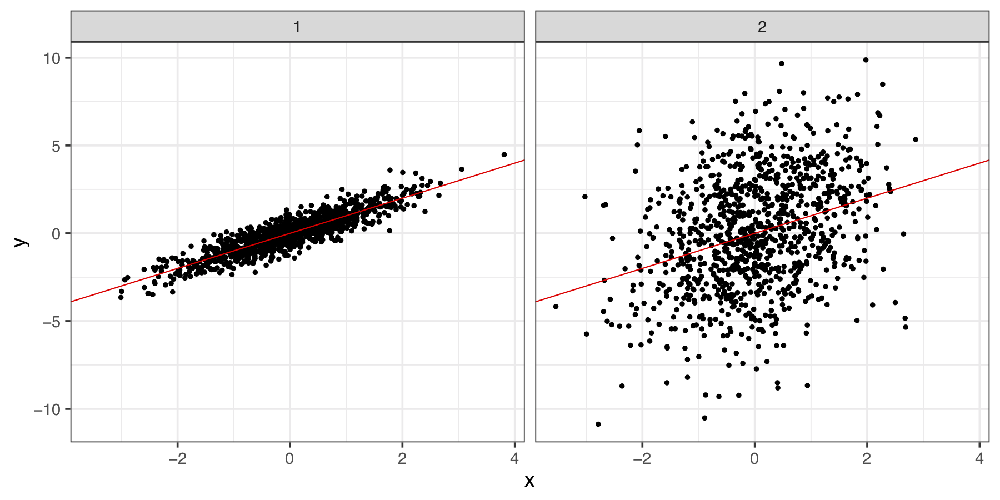
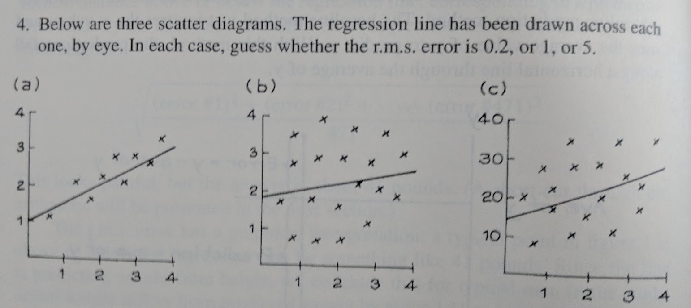
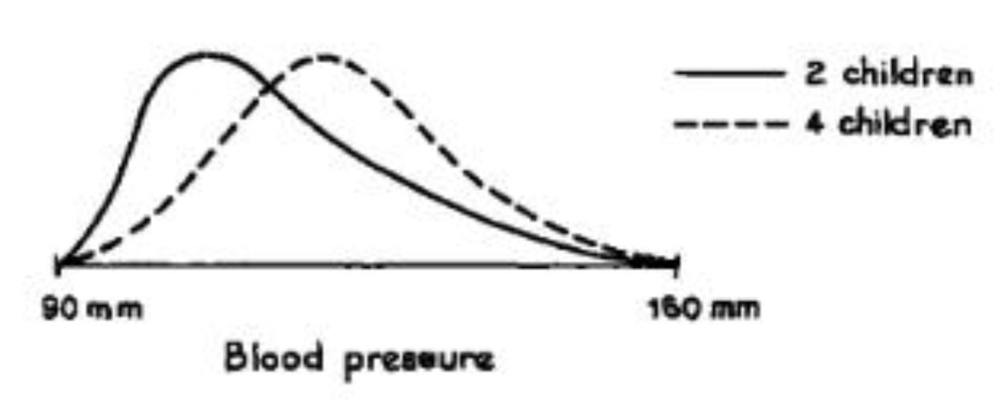
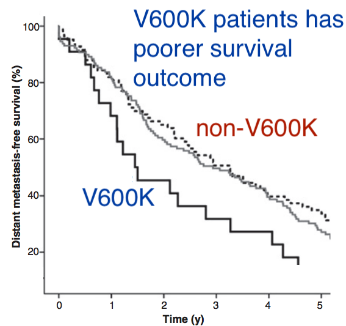
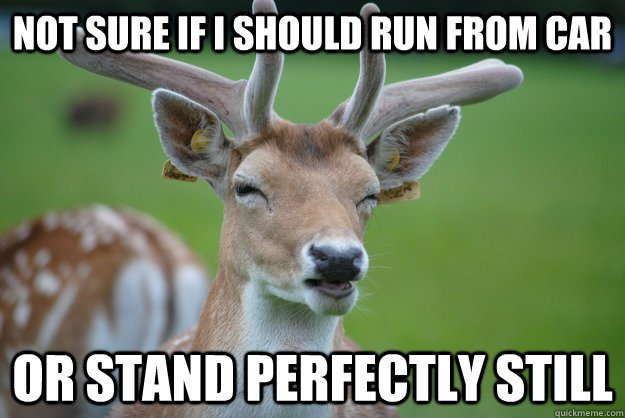

```{r, echo = FALSE}
knitr::knit_hooks$set(error = function(x, options) {
  paste0("<pre style=\"color: red;\"><code>", x, "</code></pre>")
})
```

class: segue

### Disclaimer: these materials were written based on my teaching experiences. 

Your experiences may differ. 

If symptoms persist, consult your lecturers or other senior tutors. 

---

class: segue-yellow

2018 tutor training notes

https://github.com/kevinwang09/tutor_demo/blob/master/2018_TutorTraining.pdf


R Guide

http://www.maths.usyd.edu.au/u/UG/JM/DATA1001/r/current/guides/RGuide.html

---

## Outline
.large[
+ Course changes

+ Tutorial format changes

+ Core material demo

+ Project coding demo

+ Additional coding demo (time permitting)

+ Two pedantic examples from my own tutorials
]
---

## More semantic learning & real applied skills


1.  Students will learn how to solve problems with **real** data, with strong emphasis on statistical thinking and computational skills.
1.  They will also develop essential soft skills of collaboration and communication.


> We want our students to learn the concepts of statistics (semantics) and the practice of data science. We do not want them to be drowned by formulas (syntax) they don't understand. 


.footnote[Associate Professor David Easdown has a great [paper](http://www.maths.usyd.edu.au/u/pubs/publist/preprints/2009/easdown-12.pdf) on syntactic and semantic reasoning in mathematical learning. It took me a great deal of time to appreciate the ideas.]
---


class: segue

### These courses will be different to your 1st year statistics class

---


## Kevin: why do these courses seem 'softer'?

Example 1: what is the definition of sample correlation coefficient between $x$ and $y$?

--

+ When I did 1st year statistics: 

$$r_{xy} =  \frac{\sum (x_i - \bar{x})(y_i - \bar{y})}{\sqrt{\sum (x_i - \bar{x})^2} \sqrt{\sum (y_i - \bar{y})^2}} = \frac{n \sum x_i y_i - \sum x_i \sum y_i }{\sqrt{n \sum x_i^2 - (\sum x_i)^2} \sqrt{n \sum y_i^2 - (\sum y_i)^2}}.$$

--

+ Linear algebra: it is the .brand-blue[inner product] between the .brand-blue[centered vectors] $x$ and $y$, divided by the products of their $L_2$ .brand-blue[norms].

--

+ Geometry: it is the .brand-blue[cosine of the angle] between the .brand-blue[centered vectors] $x$ and $y$.

> Correlation is a **measure of similarity** between $x$ and $y$ which informs us something about the data. But the intuitive geometric interpretation takes a bit more mathematical training. 

---

## More intuitions and more inter-linked contents

+ Visual: How **tightly clustered** are $x$ and $y$ around the trend line? 
+ Numerical: How to measure similarity $x$ and $y$ **using a number**? 

<center>

</center>

<!-- + We look at the *centre and spread* of each paired observation in $x$ and $y$ using z-scores. Then, we get a *joint summary* of the two z-scores using multiplication and averaging.  -->

+ .brand-red[Populations] correlation is the mean of the product of the .brand-blue[z-scores] of $x$ and $y$.

--

$$r_{xy}=\frac{1}{n-1}\sum_{i=1}^{n} \left(\frac {x_{i} - {\bar {x}}}{s_{x}}\right) \left(\frac {y_{i} - {\bar {y}}}{s_{y}}\right).$$ 

+ .brand-blue[z-score] was already introduced in the course. The difference between .brand-red[population] and .brand-red[sample] is emphasised again. 

---

## Format of tutorials 

+ .brand-blue[Old tutorials:] Kevin walks into the room, explains the key calculation for the first 5-10 minutes. Students do some questions on pen and paper to make sure they will know how to do this in the assignment and the final exam. 

--

+ .brand-red[New tutorials:] Students actually get a quiz for the first 10 minutes. The tutorial motivations are the data and the thinking questions in textbook. Students then complete the rest of the worksheet using R Markdown. 

<center>

</center>


---

## Tutorial preparation 

> You can't solve all questions by declaring maths formulas. 

+ Please read the [R Guide](http://www.maths.usyd.edu.au/u/UG/JM/DATA1001/r/current/guides/RGuide.html) and the tutorial worksheet & the data before the class.
+ **Discuss** the solutions (not the numerical answer) with the students, so they can see how you make **statistical arguments**. 

.footnote[
.font150[You have all demonstrated abilities in making good statistical arguments during your interview.]]


--

.pull-left[

<center>
.font90[.brand-blue[Having more children causes higher blood pressure]]

</center>

]

--

.pull-right[
<center>

</center>
]


---
class: segue

### What was the hardest thing about using `R` in your undergraduate studies?

---

## By the end of this course, students should:

+ Use RStudio and RMarkdown.
+ Read in an Excel spreadsheet.
+ Produce basic numerical and graphical summaries.
+ Write up a basic exploratory analysis report that .brand-blue[addresses a research question]. 

--

.brand-red[.font170[Common questions]]

1. Where are my **files and folders**?
1. How do I read in this **Excel sheet**? How can I **clean** my data?
1. How do I do this **graph**? How do I calculate this **number**?

> But they rarely ask the question "What is the **purpose** of this graph/number?". 

---
class: segue

# Core materials: demo for setting up the file system (Section 1.5 to 1.8 of R Guide)

---

## Some tips for RStudio + RMarkdown (1)

+ R Guide: http://www.maths.usyd.edu.au/u/UG/JM/DATA1001/r/current/guides/RGuide.html

> That inability to recognise where the Rmd/Excel files are located in which folder will be the biggest obstacle for our student in the first 4 weeks. 

+ We are aiming for one single folder for the entire course. Everyone should have the **same** folder structure. 

+ They should use a `.Rmd` file (not R script) for every tutorial. These questions get progressively harder.

+ Setting up RStudio to have the `.html` file in RHS preview window (Section 1.7) is new for 2019.

+ The biggest source of confusion is the **chunks**. Reinforce this idea that anything in a chunk is R code, everything else is your personal comments on the R outputs. 

+ Sloooooooooooooooooooowwwwwwww down for your students.


---

## Some tips for RStudio + RMarkdown (2)

+ The R Guide is the basic assessable material, there is no need to do complex coding in class.

+ But in projects, students are encouraged to explore new coding options, e.g. `tidyverse`.

<center>

</center>

.footnote[https://twitter.com/thinkR_fr/status/882604987381055489]

---

class: segue

# Coding for projects: Demo for reading and cleaning data

---

## Two simple functions

+ `readr::read_csv()` has some advantages over `utils::read.csv()`, especially with factors. 

+ `janitor::clean_names()` is perhaps the simplest function to reduce student frustrations when completing projects.

.scroll-box-20[
```{r}
dirtyIris = readr::read_csv("data/dirtyIris.csv")
colnames(dirtyIris)
janitor::clean_names(dirtyIris)
```
]


---

## Don't try to be (too) perfect

+ Students are gentle creatures, they do not like the sight of error/warnings messages in sharp red text.

```{r,error=TRUE}
ggplot(iris) +
  geom_point(aes(x = Sepal.Length, y = Sepal.Width))
```

<center>

</center>

---
## Don't try to be (too) perfect

+ Showing your programming mistakes and then correcting them can send a positive signal to your students. 

```{r, fig.height=3.5, fig.width=6}
library(ggplot2)
ggplot(iris) +
  geom_point(aes(x = Sepal.Length, y = Sepal.Width))
```

.footnote[Garth was particularly good at this. He would do live Google searches and copy StackExchange codes even though he knew the answer.]

---
class: segue

# Additional coding: Demo for subsetting data

---
## Students struggle with subsetting data (1)

`R` is partially blamed for this. This [base R cheatsheet](https://www.rstudio.com/wp-content/uploads/2016/05/base-r.pdf) helps.
.scroll-box-20[

```{r}
x = 1:5; names(x) = letters[1:5]
x[c(2)] ## Index subsetting
x[c(FALSE, TRUE, FALSE, FALSE, FALSE)] ## Logical subsetting
x[c("b")] ## Names subsetting 
x[-c(1, 3, 4, 5)] ## Eliminiation using negative indexing
head(iris$Species) ## Unique only to data.frame column subsetting
```
]
---

## Students struggle with subsetting data (2)

|                      | vector                                 | data.frame (row)                            | data.frame (column)                         |
|:----------------------:|:----------------------------------------:|:---------------------------------------------:|:---------------------------------------------:|
| Index                | `x[c(2)]`                                | `data[c(2), ]`                                | `data[, c(2)]`                                |
| Names                | `x[c("b")]`                              | `data[c("b"), ]`                              | `data[, c("b")]`                              |
| Logical              | `x[c(FALSE, TRUE, FALSE, FALSE, FALSE)]` | `data[c(FALSE, TRUE, FALSE, FALSE, FALSE), ]` | `data[, c(FALSE, TRUE, FALSE, FALSE, FALSE)]` |
|                      |                                        |                                             |                                             |
| Elimination of index | `x[-c(1, 3, 4, 5)]`                      | `data[-c(1, 3, 4, 5), ]`                      | `data[, -c(1, 3, 4, 5)]`                      |
| $                    |               -                        |          -                                  | `data$b`                                      |

+ Logical vector must be the same length as the `vector`, or number of rows/columns as the `data.frame`.
+ `$` doesn't work if the column name contain spaces*, for example `data$Sepal Length`. 
+ It is hard, and I haven't worked out the best way to teach this. Sarah suggested [this](http://adv-r.had.co.nz/Subsetting.html).


.footnote[.font150[
*This is the reason I recommend `janitor::clean_names()`. ]
]

---
class: segue

# Two examples from my tutorial

---

## Example 1


```{r, echo = FALSE}
suppressPackageStartupMessages(library(dplyr))
theme_set(
  theme_bw(20)
)
```

Student: How can I do a **dot plot** or the **line plot** for the median of the `iris` data across the `species` categories? 

--

1.  First, could you show me the data please?
2.  .brand-red[Why] do you want to see the median?

--

> First, students do not know the how. Then, they don't know the why. 

--

```{r}
# library(dplyr)
iris %>% 
  group_by(Species) %>% 
  summarise_all(median)
```


---

## Example 1

Student: So I can say that there is an *increasing trend* across the three categories for my report.
--

1.  Why not just do a boxplot across the three categories?
1.  Given the previous numbers, what you think this boxplot would look like (sketch .brand-red[by hand])?

> Students never quite formulate the question correctly, ask leading questions can help. 

```{r, echo = FALSE, fig.height=5, fig.width=16}
par(mfrow = c(1, 2))
boxplot(iris$Sepal.Length ~ iris$Species)
boxplot(iris$Sepal.Width ~ iris$Species)
```


---

## Example 2

True or false? 

In the `iris` dataset, we know the variable `Sepal.Length` is negatively correlated with `Sepal.Width`. Therefore, it is necessary that these two variables must also be negatively correlated in any arbitrarily chosen `Species`. 


```{r}
cor(iris$Sepal.Length, iris$Sepal.Width)
```

---

## Example 2

```{r, fig.height=5, fig.width=16}
ggplot(iris,
       aes(x = Sepal.Length, y = Sepal.Width)) +
  geom_point() +
  geom_smooth(method = "lm") +
  facet_grid(~Species, margins = TRUE)
```


---
## Summary 
.large[

+ There is a stronger emphasis on statistical thinking and computation.

+ You don't have to impress your students by showing you know more maths symbols. Impress them by showing more insights of the concept. 

+ The courses are different, so do necessary preparations before tutorial. The [R Guide](http://www.maths.usyd.edu.au/u/UG/JM/DATA1001/r/current/guides/RGuide.html) is your friend. 

+ Use the R [cheatsheets](https://www.rstudio.com/resources/cheatsheets/).

+ Be prepared for non-standard questions in their projects.

+ Approach your lecturers and other senior tutors for advice, we are all in this together.
]

---
## Reference
+ Easdown, D., 2009. Syntactic and semantic reasoning in mathematics teaching and learning. Int. J. Math. Educ. Sci. Technol. 40, 941–949. https://doi.org/10.1080/00207390903205488

+ Freedman, David & Pisani, Robert & Purves, Roger. Statistics (4th ed). Norton, New York. 

+ Menzies, A.M., Haydu, L.E., Visintin, L., Carlino, M.S., Howle, J.R., Thompson, J.F., Kefford, R.F., Scolyer, R.A., Long, G. V., 2012. Distinguishing clinicopathologic features of patients with V600E and V600K BRAF-mutant metastatic melanoma. Clin. Cancer Res. 18, 3242–3249. https://doi.org/10.1158/1078-0432.CCR-12-0052
