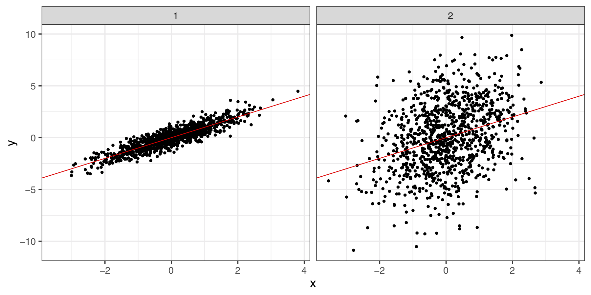
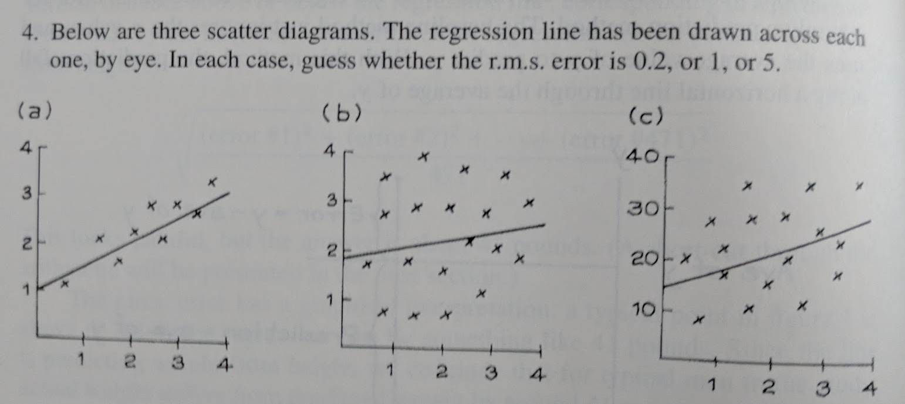

class: segue

### Disclaimer: these materials were written based on my teaching experiences. Your experiences may differ. If any symptons persist, consult your lecturer(s) or other senior tutor(s). 

---

class: segue

### These courses will be different to your 1st Year Statistics Class

---

## The courses seem 'softer'?

For example: what is the definition of sample correlation coefficient between two observed variables $x$ and $y$?

--

+ When I did 1st year statistics: 

$$r_{xy} =  \frac{\sum (x_i - \bar{x})(y_i - \bar{y})}{\sqrt{\sum (x_i - \bar{x})^2} \sqrt{\sum (y_i - \bar{y})^2}} = \frac{n \sum x_i y_i - \sum x_i \sum y_i }{\sqrt{n \sum x_i^2 - (\sum x_i)^2} \sqrt{n \sum y_i^2 - (\sum y_i)^2}}$$

--

+ Linear algebra: it is the inner product between the centered vectors $x$ and $y$, divided by the products of their $L_2$ norms.

--

+ Geometry: it is the cosine of the angle between the centered $x$ and $y$ in the $\mathbb{R}^n$ space.

> Correlation is a **measure of similarity** between $x$ and $y$ to inform us something about the data, but students get tangled up in the calculations.

---

## More intuitions and more inter-linked contents

+ How *tightly clustered* are $x$ and $y$ around the trend line? How to measure similarity $x$ and $y$ *using a number*? 

<center>

</center>

<!-- + We look at the *centre and spread* of each paired observation in $x$ and $y$ using z-scores. Then, we get a *joint summary* of the two z-scores using multiplication and averaging.  -->

+ Mean* of the product of the z-scores of $x$ and $y$, 

$$r_{xy}={\frac {1}{n-1}}\sum _{i=1}^{n}\left({\frac {x_{i}-{\bar {x}}}{s_{x}}}\right)\left({\frac {y_{i}-{\bar {y}}}{s_{y}}}\right)$$ 

+ Every single word in this definition were introduced previously in the course, and some concepts were recycled for emphasis. 

---

## Format of tutorials 

+ Old tutorials: Kevin walks into the room, explains the key calculation for the first 5-10 minutes. Students do some questions on pen and paper to make sure they will know how to do this in the assignment and the final exam. 

+ New tutorials: Students actually get a quiz for the first 10 minutes. The motivations in the lab is the data and the thinking questions in textbook. Students then complete the rest of the worksheet using R Markdown. 

<center>

</center>

> In some ways, we are asking more out of our students. Hence some strategic preparations are needed before every tutorial.

Because whenever an unexpected question arises, you can't get out of it by shouting maths formulas.

---
class: segue


### What was the hardest thing about using `R` in your undergraduate studies?

---

## Some suggestions

+ Where are my **files and folders**?
+ How do I read in this *Excel sheet*?
+ How can I *clean* my data?
+ How do I do this *graph*? How do I calculate this *number*?
+ What is the *purpose* of this analysis again?

> That inability to recognise where the Excel files are located in which folder will be the biggest obstacle for our student in the first 2 weeks <sup>1</sup>. 

+ We are using a system of RStudio and RMarkdown to make sure that our students can finish this course reading in an Excel spreadsheet, produce basic numerical and graphical summaries and write up a decent exploratory analysis report. We don't expect them to do too much complex maths and modelling until second year. 

1. But once they know, many of them just takes off and do crazy things with their data that I couldn't even do until I was in Honours.

---
class: segue

# Demo time

---

## Some tips for RStudio + RMarkdwon (1)

+ Use a R-Project to manage all files. We are aiming for one single R-Project for the entire course. All tutorials should be store here. Some additional folders could be introduced, e.g. a `data` folder.

+ Once the R-Project is opened, they should use a RMarkdown file (not R script). Every tutorial comes with one `.Rmd` file which the students will fill in. Some tutorials even has codes assuming a `data` folder has been created. 

+ The biggest fear of the students at this point is **chunks**. Try to reinforce this idea that anything in a chunk is R code, everything else is your personal comments on the R outputs (it will take them a long time to get it). 

---

## Some tips for tutorials

+ Slooooooooooow down for your students

+ dag

---

## Some tips for coding 

+ Please don't try to be (too) perfect. Showing your programming mistakes and correcting them send a positive signal to your students. Students are gentle creatures, they do not like the sight of error messages in sharp red text.

.scroll-box-20[

```{r,error=TRUE}
ggplot(iris) +
  geom_point(aes(x = Sepal.Length, y = Sepal.Width))
```

```{r,error=TRUE}
library(ggplot2)
ggplot(iris) +
  geom_point(aes(x = Sepal.Length, y = Sepal.Width))
```

]

+ Try to stick to tutorial codes and base R. Only resort to Tidyverse when the task becomes impossibly difficult in base R. 

---

## A pedantic example

+ Student: How can I do a *dot plot* or the *line plot* for the median of this data across some categories? 


1.  Show me the data first please?
1.  Why do you want to see the median?


--

+ Student: So I can claim that there is an *increasing trend* across the categories. 

1.  Why not just do a boxplot across the three categories?
1.  Could you draw for me, by hand, what you think this boxplot would look like?

---

## Try to lead your students to a more comprehensive answer

+ In the `iris` dataset, the variable `Sepal.Length` is negatively correlated with `Sepal.Width`, it is therefore necessary that these two variablse must also be negatively correlated in any arbitarily chosen `Species`. 

.scroll-box-20[

```{r}
table(iris$Species)
cor(iris$Sepal.Length, iris$Sepal.Width)
```


```{r, fig.width=15}
par(mfrow = c(1, 2))
boxplot(iris$Sepal.Length ~ iris$Species)
boxplot(iris$Sepal.Width ~ iris$Species)
par(mfrow = c(1, 1))
```

]