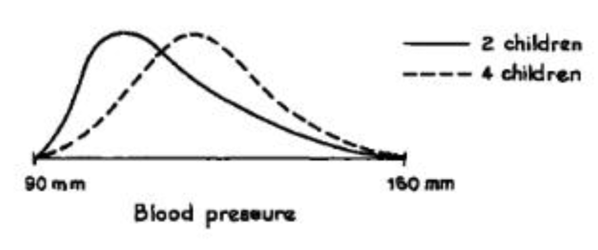
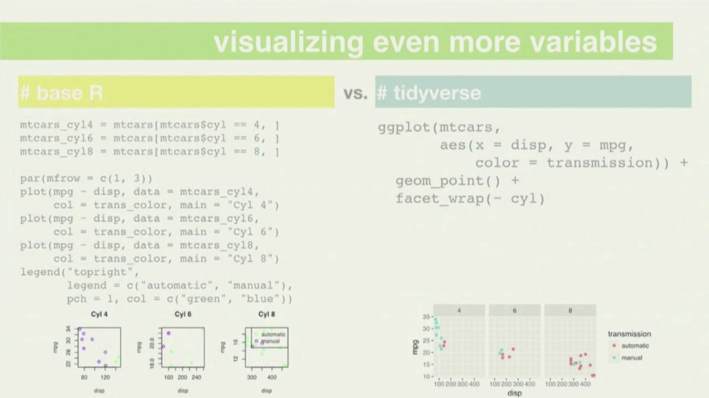

```{r, echo = FALSE}
knitr::knit_hooks$set(error = function(x, options) {
  paste0("<pre style=\"color: red;\"><code>", x, "</code></pre>")
})
```

class: segue

### Disclaimer: these materials were written based on my teaching experiences. 

Your experiences may differ. 

If symptons persist, consult your lecturers or other senior tutors. 

---

class: segue-yellow

2018 tutor training notes

https://github.com/kevinwang09/tutor_demo/blob/master/2018_TutorTraining.pdf


R Guide

http://www.maths.usyd.edu.au/u/UG/JM/DATA1001/r/current/guides/RGuide.html

---

## More semantic learning real applied skills


1.  In all these courses, the students will learn how to solve problems with **real** data, using statistical thinking and computational skills.


1.  They also develop essential soft skills of curiosity, collaboration and communication.


> We want our students to learn the concepts of statistics (semantics) and not be drowned with more formulas (syntax). 


.footnote[Associate Professor David Easdown has a great [paper](http://www.maths.usyd.edu.au/u/pubs/publist/preprints/2009/easdown-12.pdf) on syntactic and semantic reasoning in mathematical learning. It took me a great deal of time to appreciate the embodied ideas.]
---


class: segue

### These courses will be different to your 1st year statistics class

---


## Kevin: why are these courses seem 'softer'?

Example 1: what is the definition of sample correlation coefficient between two observed variables $x$ and $y$?

--

+ When I did 1st year statistics: 

$$r_{xy} =  \frac{\sum (x_i - \bar{x})(y_i - \bar{y})}{\sqrt{\sum (x_i - \bar{x})^2} \sqrt{\sum (y_i - \bar{y})^2}} = \frac{n \sum x_i y_i - \sum x_i \sum y_i }{\sqrt{n \sum x_i^2 - (\sum x_i)^2} \sqrt{n \sum y_i^2 - (\sum y_i)^2}}.$$

--

+ Linear algebra: it is the inner product between the centered vectors $x$ and $y$, divided by the products of their $L_2$ norms.

--

+ Geometry: it is the cosine of the angle between the centered vectors $x$ and $y$ in the $\mathbb{R}^n$ space.

> Correlation is a **measure of similarity** between $x$ and $y$ to inform us something about the data. But the intuitive interpretation takes a bit more mathematical training. 

---

## More intuitions and more inter-linked contents

+ How *tightly clustered* are $x$ and $y$ around the trend line? How to measure similarity $x$ and $y$ *using a number*? 

<center>

</center>

<!-- + We look at the *centre and spread* of each paired observation in $x$ and $y$ using z-scores. Then, we get a *joint summary* of the two z-scores using multiplication and averaging.  -->

+ Mean<sup>*</sup> of the product of the z-scores of $x$ and $y$

$$r_{xy}={\frac {1}{n-1}}\sum _{i=1}^{n}\left({\frac {x_{i}-{\bar {x}}}{s_{x}}}\right)\left({\frac {y_{i}-{\bar {y}}}{s_{y}}}\right).$$ 

+ Every single word in this definition were introduced previously in the course, and some concepts were recycled for emphasis. 

---

## Format of tutorials 

+ .blue[Old tutorials:] Kevin walks into the room, explains the key calculation for the first 5-10 minutes. Students do some questions on pen and paper to make sure they will know how to do this in the assignment and the final exam. 

+ .red[New tutorials:] Students actually get a quiz for the first 10 minutes. The motivations in the tutorial are the data and the thinking questions in textbook. Students then complete the rest of the worksheet using R Markdown. 

<center>

</center>


---

## Tutorial preparation 

> In some ways, we are asking more out of our students. We need them to do the statistical thinking as well as the computations.  

+ Please read the teaching guide and the tutorial worksheet & the data before the class. Solutions/code to the questions are available. Try to **discuss** the answers with the students, don't force feed them. 

--

+ Whenever an unexpected question arises, you can't get out of it by declaring maths formulas.

.pull-left[

<center>
.font90[.brand-blue[Having more children causes higher blood pressure]]

</center>

]

--

.pull-right[
<center>

</center>

]

---
class: segue

### What was the hardest thing about using `R` in your undergraduate studies?

---

## Some selected questions throughout the semester

1. Where are my **files and folders**?
1. How do I read in this **Excel sheet**? How can I **clean** my data?
1. How do I do this **graph**? How do I calculate this **number**?

> But they rarely ask the question "What is the **purpose** of this graph/number?". 

--

By the end of this course, students should:

+ Use RStudio and RMarkdown.
+ Read in an Excel spreadsheet.
+ Produce basic numerical and graphical summaries.
+ Write up a basic exploratory analysis report that .brand-blue[addresses a research question]. 

---
class: segue

# Demo for setting up the file system

---

## Some tips for RStudio + RMarkdown (Week 1 to 4)

+ http://www.maths.usyd.edu.au/u/UG/JM/DATA1001/r/current/guides/RGuide.html

> That inability to recognise where the Excel files are located in which folder will be the biggest obstacle for our student in the first 2 weeks. 

+ We are aiming for one single R-Project for the entire course. 

+ They should use a `.Rmd` file (not R script) for every tutorial. These questions ger progressively harder.

+ The biggest source of confusion is the **chunks**. Reinforce this idea that anything in a chunk is R code, everything else is your personal comments on the R outputs. 

+ Sloooooooooooooooooooowwwwwwww down for your students.

---
class: segue

# Demo for reading and cleaning data

---

## Some tips for coding (1)

+ `janitor::clean_names()` is perhaps the simplest function to reduce student frustrations when completing projects.


.scroll-box-20[
```{r}
dirtyIris = readr::read_csv("data/dirtyIris.csv")
colnames(dirtyIris)
janitor::clean_names(dirtyIris)
```
]


---

## Some tips for coding (2)

+ Students are gentle creatures, they do not like the sight of error/warnings messages in sharp red text.


```{r,error=TRUE}
ggplot(iris) +
  geom_point(aes(x = Sepal.Length, y = Sepal.Width))
```


<center>

</center>


---

## Don't try to be (too) perfect

+ Showing your programming mistakes and then correcting them send a positive signal to your students. 

+ Garth was particularly good at this. He would do live Google searches even though he probably knows the answer. 

--


```{r, fig.height=3.5, fig.width=6}
library(ggplot2)
ggplot(iris) +
  geom_point(aes(x = Sepal.Length, y = Sepal.Width))
```

---
## Some tips for coding (3)

Use `tidyverse` sparingly:

<center>

</center>


---

## A pedantic example

+ Student: How can I do a **dot plot** or the **line plot** for the median of the `iris` data across the `species` categories? 

1.  First, could you show me the data please?
1.  .red[Why] do you want to see the median?

--

<br>

+ Student: So I can say that there is an *increasing trend* across the three categories for my report.

1.  Why not just do a boxplot across the three categories?
1.  Could you draw for me, .red[by hand], what you think this boxplot would look like?

---

## True or false? 

+ In the `iris` dataset, the variable `Sepal.Length` is negatively correlated with `Sepal.Width`, it is therefore necessary that these two variablse must also be negatively correlated in any arbitarily chosen `Species`. 


```{r}
table(iris$Species)
cor(iris$Sepal.Length, iris$Sepal.Width)
```

---

## Try to lead your students to a more comprehensive answer

```{r, fig.width=11}
par(mfrow = c(1, 2))
boxplot(iris$Sepal.Length ~ iris$Species)
boxplot(iris$Sepal.Width ~ iris$Species)
```

---
## Summary 
.large[

+ There is a stronger emphasis on statistical thinking and computation.

+ You don't have to impress your students by showing you know more maths symbols. 

+ Impress them by showing more insights of the concept. 

+ The courses are different, so do necessary preparations before tutorial.

+ Be prepared for non-standard questions in their projects.

+ Approach your lecturers and other senior tutors for advice, we are all in this together.
]

---
## Reference

+ Freedman, David & Pisani, Robert & Purves, Roger. Statistics (4th ed). Norton, New York. 

+ Distinguishing Clinicopathologic Features of Patients with V600E and V600K BRAF-Mutant Metastatic Melanoma
Alexander M. Menzies, Lauren E. Haydu, Lydia Visintin, Matteo S. Carlino, Julie R. Howle, John F. Thompson, Richard F. Kefford, Richard A. Scolyer and Georgina V. Long. Clin Cancer Res June 15 2012 (18) (12) 3242-3249; DOI: 10.1158/1078-0432.CCR-12-0052
